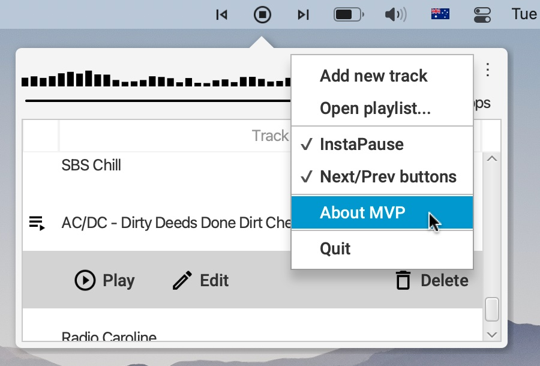

Minimal Viable Player
=====================

Lives in the taskbar and plays streaming audio.

Features
--------
* Supports MP3, FLAC, Opus and HLS streams.
    * Powered by [BASS audio library](http://www.un4seen.com/bass.html).
* InstaPause - player stops playback when the option is enabled and default output device changes
or continues using new default output device.
* Playlist is persisted between player restarts.

Controls
--------
* Show or hide playlist - do right mouse click on the player's icon(s).
* Add a new track or open an .m3u playlist - use the main menu.
* Delete a track - hover mouse over some track in the playlist and click the Trash can icon.
* Play a track - highlight a track in the playlist and do left mouse click on the player's icon.
* Stop player - do left mouse click on the player's icon.
* Play next or previous tracks - while some track is being played, do left mouse click on the player's icons.
    * By default, Next and Previous buttons are hidden and can be made visible via the main menu.
* _Play/Pause_, _Next_ and _Previous_ media keys are supported too.
    * On macOS, to prevent iTunes / Music app from launching when _Play/Pause_ media key is pressed,
    hold any of _Command_, _Control_ or _Option_ keys.
* Enable or disable InstaPause - use the main menu.
